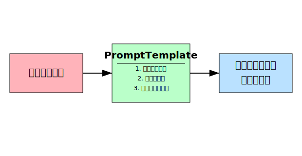

## PromptTemplateとは

PromptTemplateはユーザー入力を言語モデルに渡す準備ができたデータ（プロンプト）に変換するLangChainの概念です。

**図解**

```
[ユーザー入力]  --->  [PromptTemplate]  --->  [言語モデルへのプロンプト]
```



**PromptTemplateの動作**

1. **ユーザー入力の受け取り:**  PromptTemplateは、ユーザーから生のテキスト入力を受け取ります。  
2. **データ変換:**  PromptTemplateは、受け取ったユーザー入力を、言語モデルが理解できる形式のプロンプトに変換します。  
   この変換には、システムメッセージの追加や、ユーザー入力を使用したテンプレートのフォーマットなどが含まれます。  
3. **プロンプトの出力:**  変換されたプロンプトは、言語モデルに入力として渡されます。

**PromptTemplateの利点**

* **再利用性:**  一度作成したPromptTemplateは、異なるユーザー入力に対して繰り返し使用できます。
* **柔軟性:**  PromptTemplateは、ユーザー入力に基づいてプロンプトを動的に生成できます。
* **保守性:**  プロンプトの構造がコードとして定義されているため、変更や管理が容易になります。 

## PromptTemplateの作成

それでは、PromptTemplateを作成します。  
PromptTemplateには、次の2つのユーザー変数を受け取ります。

- language：テキストの翻訳先言語
- text：翻訳するテキスト

まず、システムメッセージとしてフォーマットする文字列を作成します。

```ts
const systemTemplate = "次の文章を英語から{language}に翻訳してください。";
```

次に、`systemTemplate`とテキストの配置場所を指定するより単純なテンプレートを組み合わせて、PromptTemplateを作成します。  
まずは、`@langchain/core/prompts`から`ChatPromptTemplate`をインポートします。

```ts
import { ChatPromptTemplate } from "@langchain/core/prompts";
```

次に、定数`promptTemplate`を用意します。  
`ChatPromptTemplate`から`fromMessages`メソッドを呼び出します。  
`fromMessages`メソッドの引数には、配列の中に2つの配列を用意します。  
1つ目には、キーを`system`で、値を`systemTemplate`とします。  
2つ目には、キーを`user`で、値を`{text}`とします。

```ts
const promptTemplate = ChatPromptTemplate.fromMessages([
  ["system", systemTemplate],
  ["user", "{text}"],
]);
```

## PromptTemplateの使用

定数`promptTemplate`から、`invoke`メソッドを呼び出します。  
`invoke`メソッドの引数には、`language`プロパティと`text`プロパティのオブジェクトを渡します。  
`promptTemplate`単独でどのような動作をするのかを確認するために、以下のように試すことができます。

```ts
const res = await promptTemplate.invoke({ language: "japanese", text: "hi" });
```
